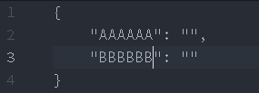

# atom-move-line package

This package takes care of trailing commas when you moving lines in json with 'editor:move-line-up' and 'editor:move-line-down'.

This functionality is inspired by JetBrains products.

Please, report any bug You find.
